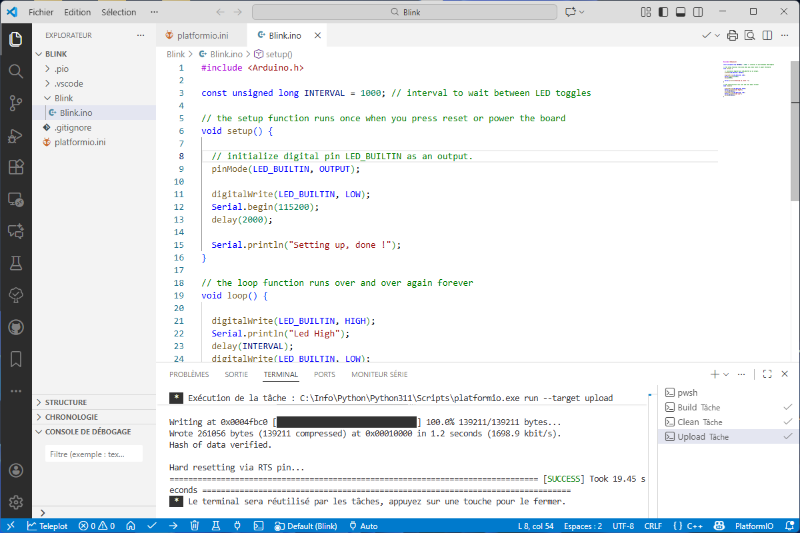
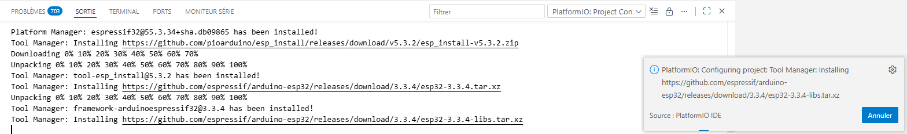
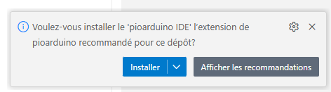
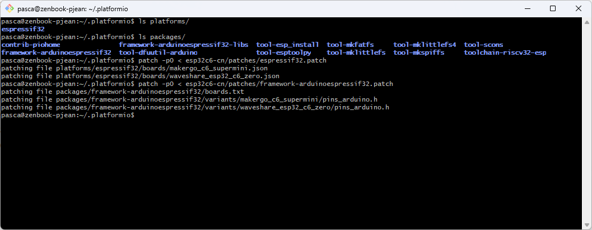
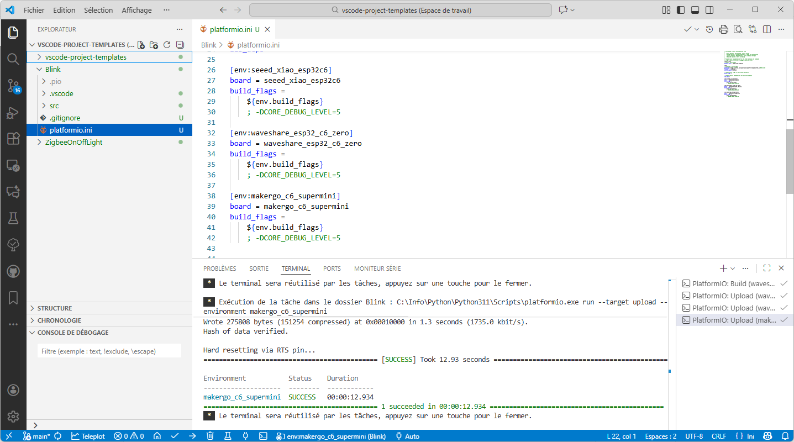
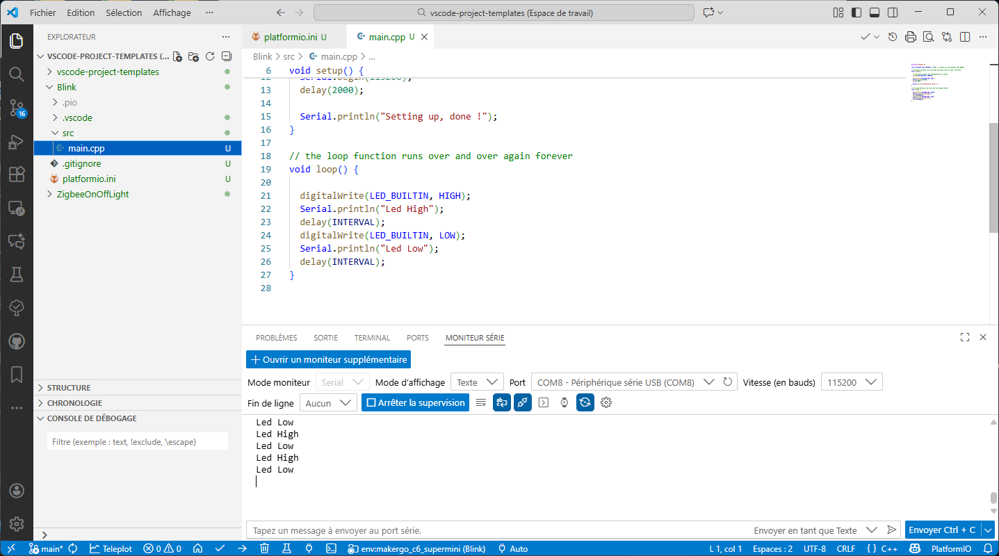

# Instructions to add ESP32-C6 board support to PlatformIO

PlatformIO does not natively support ESP32-C6 boards. The PlatformIO ESP32 framework relies on Arduino core version 2, while ESP32-C6 boards (and Zigbee features) require Arduino core version 3. The Arduino IDE now supports this through the [`espressif32`](https://espressif.github.io/arduino-esp32/package_esp32_index.json) platform, but PlatformIO has not yet caught up.

## Using the ESPressif32 platform from the PioArduino project

To work with ESP32-C6 boards in PlatformIO you must rely on the `espressif32` platform provided by the [PioArduino](https://github.com/pioarduino) project.

Update your project's `platformio.ini` file by replacing the line:

```ini
platform = espressif32
```

with:

```ini
platform = https://github.com/pioarduino/platform-espressif32.git#55.03.34
```

> If you have already used PlatformIO with ESP32 boards, delete the `~/.platformio/platforms/espressif32` folder (or on Windows `C:\Users\YourName\.platformio\platforms\espressif32`) and the `~/.platformio/packages/framework-arduinoespressif32` folder (or on Windows `C:\Users\YourName\.platformio\packages\framework-arduinoespressif32`) before continuing. Close VSCode prior to deleting these folders.

The `Blink` subfolder contains a PlatformIO project that you can use to verify the installation.

After installing the PlatformIO extension in VSCode, open the `Blink` folder with PlatformIO and click "Build" (the checkmark icon next to the house icon in the status bar) to compile the project:



The first build can take some time because PlatformIO needs to download and configure the new platforms and frameworks.



**IMPORTANT NOTICE**
When the project opens in PlatformIO you may see a notification suggesting the installation of the PioArduino extension. **Do not install this extension**, as it is unnecessary and may interfere with PlatformIO. Use the small gear icon next to the warning to hide the message in the future.



By default, the project targets the _Seed XIAO ESP32-C6_ board, which is supported by the `espressif32` platform from the PioArduino project. The _Waveshare ESP32-C6 Zero_ and _MakerGO ESP32-C6 SuperMini_ boards are not yet supported out of the box, so patches are required to add support for them.

## Adding support for the Waveshare ESP32-C6 Zero and MakerGO ESP32-C6 SuperMini boards

The `esp32c6-cn` subfolder contains the patches needed to add support for the _Waveshare ESP32-C6 Zero_ and _MakerGO ESP32-C6 SuperMini_ boards. Install Git Bash (included with [Git for Windows](https://git-scm.com/download/win)) to apply the patches.

Follow these steps to apply the patches:

- Open the `~/.platformio` folder, or on Windows `C:\Users\YourName\.platformio`
- Copy the `esp32c6-cn` folder (containing the patches) into the `.platformio` folder
- Before patching, ensure the `.platformio/platforms` folder contains **one** `espressif32` directory and `.platformio/packages` contains **one** `framework-arduinoespressif32` directory. If that is not the case, close VSCode and delete every `espressif32` and `framework-arduinoespressif32` folder found there, then reopen VSCode and rebuild the project so PlatformIO downloads the correct versions
- Right-click **inside** the `.platformio` folder and choose `Git Bash Here` to open a **Git Bash** terminal
- Apply the patches to add ESP32-C6 board support by running:

```bash
patch -p0 < esp32c6-cn/patches/espressif32.patch
patch -p0 < esp32c6-cn/patches/framework-arduinoespressif32.patch
```



**Important notes**
- The patches only add or adjust the lines that are needed; they do not replace entire files
- If a `Hunk FAILED` error appears during patching it means the installed version has changed. In that case you must regenerate the patches from the new upstream versions
- Keep the patch files outside of the folders that are being modified (best practice)

Once the patches are applied you can configure the PlatformIO project to use the _Waveshare ESP32-C6 Zero_ or _MakerGO ESP32-C6 SuperMini_ board by switching the configuration in the PlatformIO status bar, then build for those boards:



Open the serial monitor tab to see the debug output:



_Note that these boards are not yet supported by the Arduino IDE either, but you can install the [esp32c6-cn-package](https://github.com/epsilonrt/esp32c6-cn-package) to add them._
