# Tutorial: Develop in C/C++ on Windows with VSCode, MSYS2, CMake and Git

When starting out with C/C++ programming, choosing a compiler and a development environment is one of the first decisions to make.
Although it may not be the easiest option, VS Code (Visual Studio Code) is a good choice because it is open-source and available on all platforms. In addition, its wide range of extensions allows it to adapt to any language and development target.

However, this flexibility can be a drawback for beginners in C/C++ programming, as no compiler or build system is provided by default.

For the compiler, the most logical choice is the GNU C Compiler (gcc). However, on Windows, the Microsoft Visual Studio Compiler is a standard reference. The choice will depend on your specific goals.

Finally, you need to choose a build system. A build system handles configuration, compilation, and linking operations to generate an executable or library from a set of source files. There are many options in this area, from the classic Make to more complex tools like Autotools, but CMake remains a popular choice.

In this document, we will use the following on Windows:  
- VS Code as the development environment  
- CMake as the build system  
- gcc as the C/C++ compiler  
- and git as the version control system.

## 1. Install Visual Studio Code

1. Go to the official download page:  
    [https://code.visualstudio.com/](https://code.visualstudio.com/)
2. Download the Windows version and install it. **Be sure to choose "User Installer" for installation without administrator rights.**

---

## 2. Install MSYS2

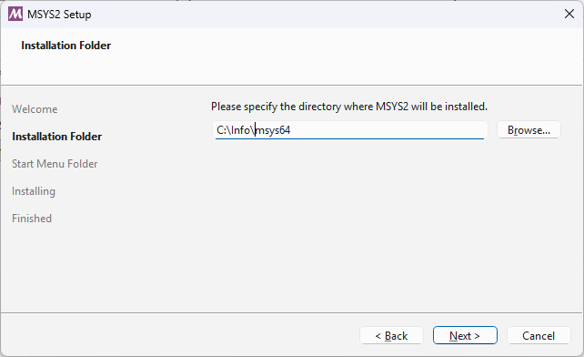

1. Go to the official website:  
    [https://www.msys2.org/](https://www.msys2.org/)
2. Download the installer for your architecture (x86_64 for most modern PCs).
3. MSYS2 must be installed in `C:\Info\msys64`. Run the installer and follow the instructions.
4. Open the **MSYS2 UCRT64** terminal ("MSYS2 UCRT64" icon).

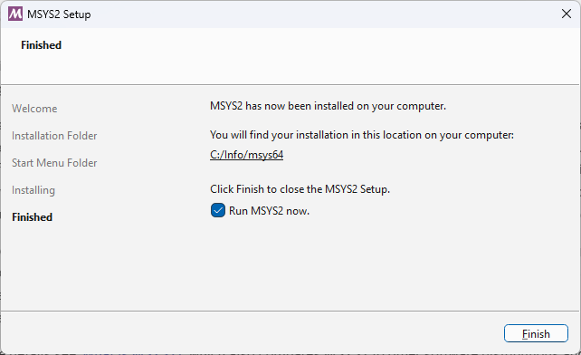

---

## 3. Update MSYS2 and install required tools

In the MSYS2 terminal, run the following commands:

```sh
# Update the system
pacman -Syu
# Close the terminal if prompted, then reopen and continue:
pacman -Su
```

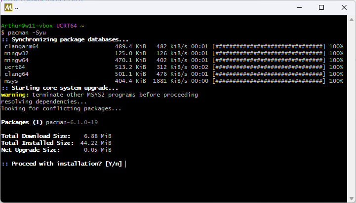

```sh
# Install C/C++ development tools, CMake and Git
pacman -S --needed base-devel mingw-w64-ucrt-x86_64-toolchain mingw-w64-ucrt-x86_64-cmake git
```

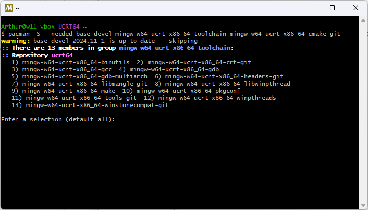

---

## 4. Add MSYS2 to PATH for VSCode

> **Why choose ucrt64?**
> The **ucrt64** variant of MSYS2 uses Microsoft's Universal C Runtime (UCRT), ensuring better compatibility with modern Windows applications, Visual Studio, and recent libraries. It is recommended for new C/C++ projects on Windows as it facilitates interoperability, portability, and character encoding management.

To let VSCode detect MSYS2 UCRT64 tools, add the path `C:\Info\msys64\ucrt64\bin` to your Windows `PATH` environment variable.

1. Open Advanced System Settings → Environment Variables.
2. Edit your user `Path` variable.
3. Add:  
    `C:\Info\msys64\ucrt64\bin`
4. Move this new path to the top of the list.
5. Save and restart your computer for the changes to take effect.

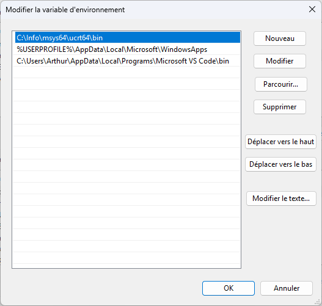

> **Important note:**
> In MSYS2 UCRT64, the make binary provided by the `mingw-w64-ucrt-x86_64-make` package is called `mingw32-make.exe` (not `make.exe`).
> To build your projects, use the `mingw32-make` command in the terminal, or let CMake Tools detect it automatically.
> If `which make` returns `/usr/bin/make`, that's the MSYS2 POSIX make, which is not compatible with the UCRT64 toolchain.
---


## 5. Install Git for Windows and recommended VSCode extensions

Before installing extensions, install **Git for Windows**:

1. Download the official installer from [https://git-scm.com/](https://git-scm.com/).
2. During installation, choose the folder `C:\Info\Git` as the custom installation path.
3. Leave all other options as default.
4. Once installed, restart VSCode so it detects Git automatically.

Then, in VSCode, install the following extensions:

- **C/C++ Extension Pack** (Microsoft, recommended)  
   [Direct link](https://marketplace.visualstudio.com/items?itemName=ms-vscode.cpptools-extension-pack)
      - Includes: C/C++, CMake Tools, CMake, Clang-Format, Clangd, Include Autocomplete, etc.
- **Project Templates** (to quickly create projects), accept to trust the publisher Cantonios.  
   [Direct link](https://marketplace.visualstudio.com/items?itemName=cantonios.project-templates)
- **Git History** (to view Git history)  
   [Direct link](https://marketplace.visualstudio.com/items?itemName=donjayamanne.githistory)

---

## 6. Configure VSCode for MSYS2

In VSCode, open settings (`Ctrl+,`) and search for `terminal.integrated.profiles.windows`.
Add a profile for MSYS2 **making sure to add it to the existing list** (separate each profile with a comma).

```json
"terminal.integrated.profiles.windows": {
   "MSYS2 UCRT64": {
      "path": "C:\\Info\\msys64\\usr\\bin\\bash.exe",
      "args": ["--login", "-i"],
      "icon": "terminal-bash",
      "env": {
         "MSYSTEM": "UCRT64"
      }
   }
}
```

> **Note:** This profile starts the UCRT64 environment by setting the `MSYSTEM=UCRT64` environment variable, matching the behavior of the "MSYS2 UCRT64" Start Menu icon. Make sure the path matches your installation.

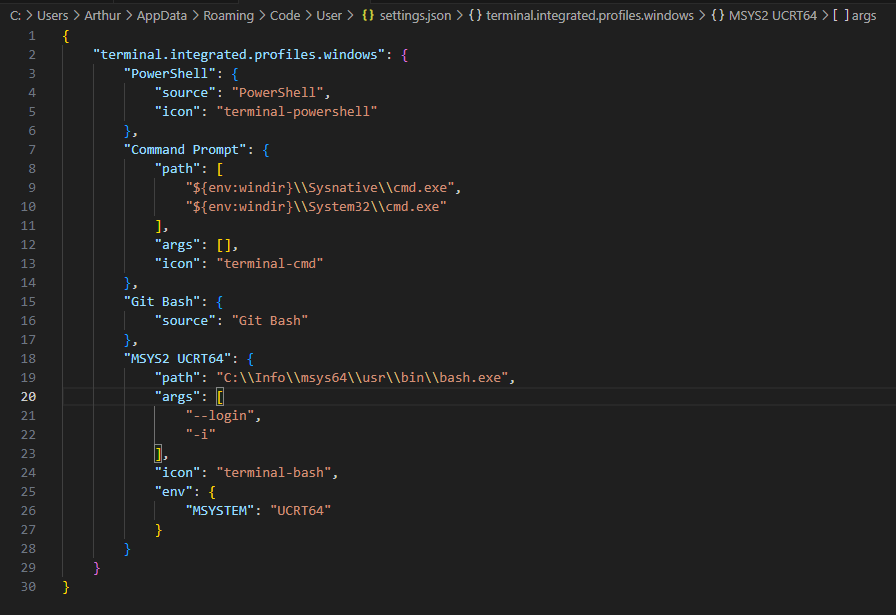

You can now open an MSYS2 terminal directly in VSCode.

To do so, open an integrated terminal (`Ctrl+ù` or Terminal > New Terminal), then click the arrow next to the “+” button and select the **MSYS2 UCRT64** profile from the list. If needed, close and reopen the terminal to use the correct profile.

---


## 7. Create, build, and debug a sample project with Project Templates

### Before you start: organize your repositories in a `src` folder

1. In Windows File Explorer, create a `src` folder wherever you want (e.g., `C:\Users\<your-name>\src`).
2. All your repositories (templates, labs, etc.) will be placed in this folder for clarity.

### 7.1. Clone the templates repository

In VSCode, open the command palette (`Ctrl+Shift+P`) and type `Git: Clone`. Paste the following URL:

```
https://github.com/epsilonrt/vscode-project-templates.git
```

When VSCode asks for the destination folder, select the `src` folder you just created (`C:\Users\<your-name>\src`).
Then open the cloned folder in VSCode if not already done.

### 7.2. Configure the Project Templates extension

1. In VSCode, open the settings (`Ctrl+,`) and search for `projectTemplates.templatesDirectory`.
2. Add or edit the following line (adapt the path to your setup):
    ```json
    "projectTemplates.templatesDirectory": "C:/Users/<your-name>/src/vscode-project-templates"
    ```
3. Save the settings.json file.
> **Note:** There is no other solution: this parameter must be set manually in settings.json for the extension to detect your custom templates.

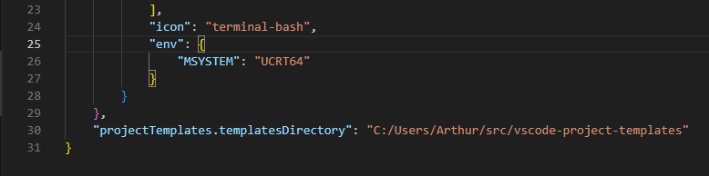

### 7.3. Create a new project from the 'MSys2 CMake C Project' template

1. In File Explorer, create a `vscode-labs` folder in `src` to group all your labs:
    - `C:\Users\<your-name>\src\vscode-labs`
2. Inside `vscode-labs`, create a subfolder for the Hello project (e.g., `Hello`).
    - `C:\Users\<your-name>\src\vscode-labs\Hello`
3. In VSCode, open the `Hello` folder (`File > Open Folder...` or drag the folder into the VSCode window).
4. Open the command palette (`Ctrl+Shift+P`).
5. Type `Project Templates: Create Project from Template`.
6. Select the **MSys2 CMake C Project** template and give the project a name (e.g., `Hello`).
7. Confirm to generate the project in the `Hello` folder.

### 7.4. Configure and build the project with CMake Tools

1. Click the CMake icon in the left sidebar of VSCode (or use the `CMake: Configure` command) to configure the project.
2. Choose the kit corresponding to **MSYS2 UCRT64** (the name may vary).
3. Click the "Build" (gear) icon in the status bar to build the project.

### 7.5. Run the program with CMake Tools

1. Click the "Play" (triangle) icon in the VSCode status bar to run the compiled binary.
2. The program output will appear in the integrated terminal or the CMake Tools output panel.

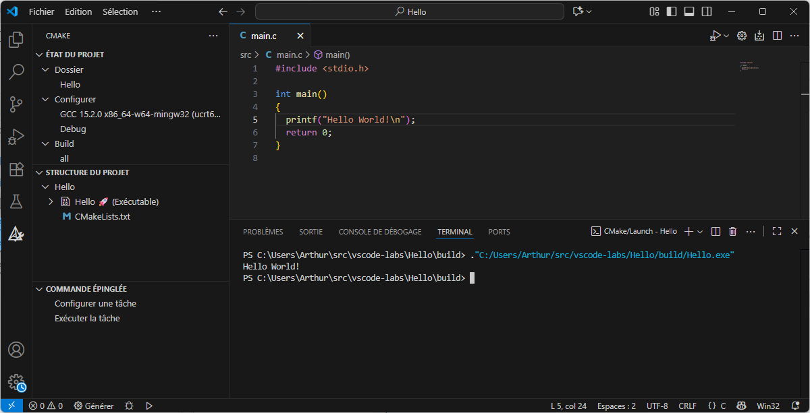

### 7.6. Debug the project with the provided configuration

The project template already contains a `.vscode/launch.json` file with a debug configuration named **Debug CMake Project (MSYS2 ucrt64)**.

To start debugging in VSCode:

1. Make sure the project is built (see previous step).
2. Click the "Run and Debug" icon in the left sidebar (or use `Ctrl+Shift+D`).
3. In the dropdown at the top, select the **Debug CMake Project (MSYS2 ucrt64)** configuration.
4. Click the green "Start Debugging" button (or press `F5`).
5. The debugger will automatically attach to the executable generated by CMake, using gdb from MSYS2 UCRT64.

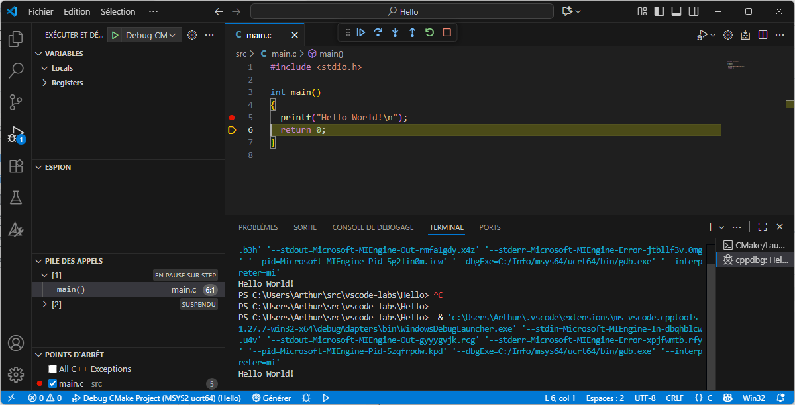

You can set breakpoints, inspect variables, and use all VSCode debugging features.

> **Note:**
> If the debugger does not stop automatically at launch, set a breakpoint (left-click in the margin) on the `printf` line in your main source file before starting the debug session. This ensures execution stops on your code.

For more details, see the official guide on C/C++ debugging in VSCode:
[https://code.visualstudio.com/docs/cpp/debugging](https://code.visualstudio.com/docs/cpp/debugging)

---

## 8. Take advantage of GitHub and GitHub Copilot in VSCode

### 8.1. Create a GitHub account and connect VSCode to your GitHub account

1. Go to [https://github.com/](https://github.com/) and sign up with your student email address.  
2. Click the account icon at the bottom left of VSCode, then "Sign in to GitHub to use AI".  
3. Follow the instructions to authorize VSCode to access your GitHub account.

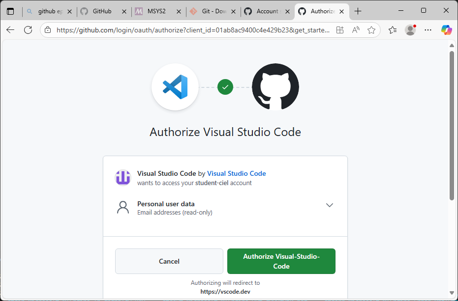

### 8.2. Create a GitHub repository for your labs

1. In VSCode, open your project folder (e.g., vscode-labs).
2. Open the Source Control tab (Git branch icon on the left or `Ctrl+Shift+G`).
3. Click "Publish to GitHub".
4. Name your repository, e.g., `vscode-labs`.
5. Choose visibility (private or public) and confirm.

### 8.3. Version and push your project to GitHub

1. In the Source Control tab, enter a commit message (e.g., `First commit for Lab 1`).
2. Click the checkmark (✓) to commit.
3. Click "Synchronize Changes" or "Push" to send your commit to GitHub.

Your project is now versioned and saved in your personal GitHub repository!

### 8.4. Use Copilot to modify main.c

You can ask GitHub Copilot to modify the `main.c` file to print "Hello World!" 10 times.

**Example prompt to enter in Copilot Chat or the Copilot command palette:**

> Modify main.c to print "Hello World!" 10 times when run.

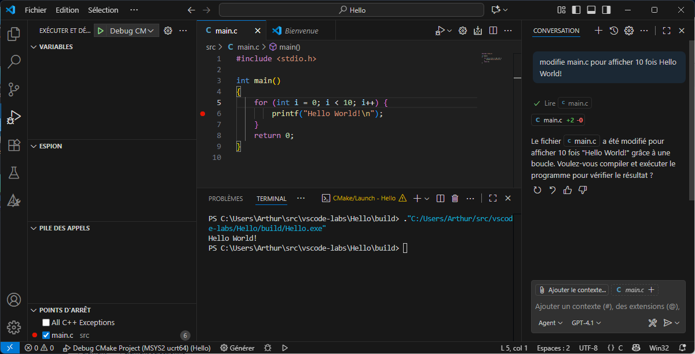

Copilot will then suggest the appropriate code, usually a `for` loop with a `printf`. Accept the suggestion or copy it into your file.

---

## 9. Resources

- [Official MSYS2 documentation](https://www.msys2.org/docs/)
- [CMake documentation](https://cmake.org/cmake/help/latest/)
- [VSCode C/C++ documentation](https://code.visualstudio.com/docs/languages/cpp)

---

*This guide was written with the help of GitHub Copilot.*
